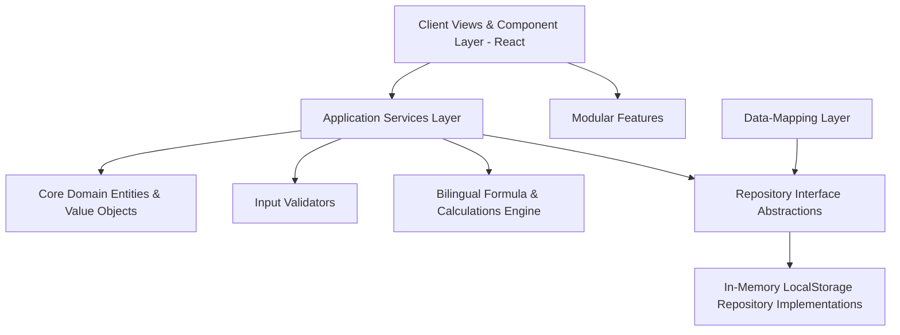

# ROWAD Enterprise Platform

[](#)
[](#)
[](#)
[](#)
[](#)

A modular, multi-tenant corporate Construction Operations Platform designed to manage mega-infrastructure pre-award proposals and post-award site execution transactions. By establishing absolute architectural segregation between client presentation views and standard domain business logic, the platform ensures total computational accuracy and complete compliance with corporate parameters.

* **Mission**: Eliminate fragmented sheets and manual spreadsheet calculations across engineering groups, replacing them with a singular, double-verified, bilingual digital ledger.
* **Vision**: Deliver a fully scalable, real-time "digital twin" of estimation, commercial tracking, scheduling offsets, and regulatory compliance on high-complexity mega-projects.
* **Main Capabilities**:
  * **Bilingual Execution**: Fluent real-time English and Arabic language translation toggle across all metrics and workflows.
  * **Algorithmic Estimation**: Exact mathematical formula checks for tender estimation thresholds and bidding guarantees.
  * **Automated Schedule Triggers**: Programmatic timeline offsets for pre-award proposal reviews and municipal permits.
  * **Double-Layered EDMS**: Complete document revision controls enforcing a strict "Makers & Checkers" verification.
  * **Computed Executive Reporting**: Dynamically compiled read-only performance digests (SPR) aggregating commercial site indicators without database CRUD overhead.

---

## Product Overview

ROWAD acts as a centralized operations hub for mid-to-large-scale general contractors. Rather than scattering construction management across disparate email threads and offline calculators, the platform aligns multi-disciplinary engineers into standard operational pipelines.

### Current Implemented Modules
1. **Executive Dashboard**: Unified cross-project performance visualizer tracking combined active contract sizes, bidding margins, risk levels, and operational health scores.
2. **Pre-Award (Tenders)**: A comprehensive five-step creation wizard managing upcoming project bids, pricing estimations, performance schedules, and bonding requirements.
3. **Project Setup Center**: Multi-step configuration staging gate verifying commercial terms, schedule baselines, project office assignments, and mandatory documents prior to project activation.
4. **Project Controls (Execution Workspace)**: A real-time commercial ledger tracking Interim Payment Certificates (IPCs), Scope Variation Orders (VOs), Contractual Claims, subcontractors, and municipal permits (NOCs).
5. **Operations Center (Calendar)**: A highly interactive visual scheduling environment graphing critical milestones, technical proposal reviews, and field validation sessions.
6. **Document Control (EDMS)**: An engineering document management hub featuring transmittals, discipline-based filters, revision logs, and double-approval workflows.

---

## Platform Architecture

The platform is designed around strict **Domain-Driven Design (DDD)** and **Clean Architecture** patterns, preserving decoupled business boundaries to enable seamless backend migrations.



---

## Folder Structure

```text
/
├── docs/                      # Centralized Documentation (The Platform Brain)
│   ├── adr/                   # Architecture Decision Records (ADRs v11-17)
│   ├── architecture/          # Core specifications (Models, Lifecycles, API Contracts)
│   ├── qa/                    # Consolidated QA review punch lists and reports
│   ├── reports/               # History completion reports and coverage logs
│   └── releases/              # Version release notes and matrices
├── src/                       # Main Code Workspace
│   ├── domain/                # Decoupled Domain entities, aggregates, and schemas
│   ├── services/              # Transactional orchestration services
│   ├── repositories/          # Interface abstractions & persistent adapters
│   ├── business-rules/        # Stateless calculation algorithms
│   ├── validators/            # Formal data input validators
│   ├── mappers/               # Data-conversion DTO adapters
│   ├── features/              # Modular React feature component blocks
│   ├── components/            # Reusable atomic UI components (Badges, Buttons)
│   ├── hooks/                 # Shared React hooks (e.g. useProjects)
│   └── views/                 # Root View layers (Dashboard, ProjectsPage)
```

---

## Core Documentation References

Core logic, architecture schemas, and specifications are maintained inside the `/docs` folder. Developers **must** read these files before writing code:

| Document | Purpose |
| :--- | :--- |
| **[SYSTEM_ARCHITECTURE.md](./docs/architecture/SYSTEM_ARCHITECTURE.md)** | Core Clean Architecture specifications and layer boundaries. |
| **[API_SERVICES.md](./docs/architecture/API_SERVICES.md)** | Catalog of service methods, dependency mappings, and FastAPI endpoints. |
| **[DOMAIN_MODEL.md](./docs/architecture/DOMAIN_MODEL.md)** | Bounded DDD aggregate roots (Project, Tender) and value objects. |
| **[FOLDER_STRUCTURE.md](./docs/architecture/FOLDER_STRUCTURE.md)** | File layout structure, allowed imports, and forbidden import boundaries. |
| **[PROJECT_LIFECYCLE.md](./docs/architecture/PROJECT_LIFECYCLE.md)** | Standard workflow states, locked panels, and lifecycle transitions. |
| **[PROJECT_SETUP.md](./docs/architecture/PROJECT_SETUP.md)** | Setup Center wizard checklist validation and draft hydration rules. |
| **[PROJECT_ACTIVATION.md](./docs/architecture/PROJECT_ACTIVATION.md)** | Authoritative project activation policies and sequences. |
| **[CACHE_ARCHITECTURE.md](./docs/architecture/CACHE_ARCHITECTURE.md)** | Repository callback caching mechanics and invalidation loops. |
| **[PRESENTATION_SERVICES.md](./docs/architecture/PRESENTATION_SERVICES.md)** | Centralized status and lifecycle styling and reusable badges. |
| **[KPI_ENGINE.md](./docs/architecture/KPI_ENGINE.md)** | Mathematical formulas and roadmap of implemented and placeholder KPIs. |
| **[DATA_FLOW.md](./docs/architecture/DATA_FLOW.md)** | Visual pipeline from Tender Awarding through project execution. |
| **[DEVELOPER_GUIDE.md](./docs/DEVELOPER_GUIDE.md)** | Standard onboarding manual for new developers, PR, and QA checklists. |
| **[VERSION_MATRIX.md](./docs/releases/VERSION_MATRIX.md)** | Historical version roadmap changes from v1.0 through v1.5. |

---

## Getting Started

### Prerequisites
* **Node.js** (v18.0 or higher recommended)
* **npm** (v9.0 or higher)

### Installation
1. Clone the repository to your local workspace:
   ```bash
   git clone https://github.com/your-org/rowad-enterprise-platform.git
   cd rowad-enterprise-platform
   ```
2. Install all development and production dependencies:
   ```bash
   npm install
   ```

### Project Scripts
Execute the following commands in the root directory:

* **Run Locally (Dev)**: Launches local Vite development server on port `3000`:
  ```bash
  npm run dev
  ```
* **Build Project**: Compiles static production bundle optimized for high-performance deployment:
  ```bash
  npm run build
  ```
* **Lint Code**: Validates TypeScript typing constraints and ensures 100% compile safety:
  ```bash
  npm run lint
  ```

---

## Current Status & Version Matrix

### Current Release: `v1.5.0` (Enterprise Foundation Release)
* **Major Features**: Centralized Project Setup wizard, automatic settings promotion, dynamic cache invalidation on repository writes, unified bilingual badges.
* **Database / Persistence Changes**: Setup draft eviction upon project activation; settings promoted to Project aggregate master.
* **Known Limitations**: LocalStorage persistence; requires migration to FastAPI backend.

---

## License

This repository is **Proprietary & Enterprise Confidential**. Unauthorized distribution, copying, or modification of these files is strictly prohibited under corporate policies.

© 2026 ROWAD Industrial & General Contracting Group. All rights reserved.
