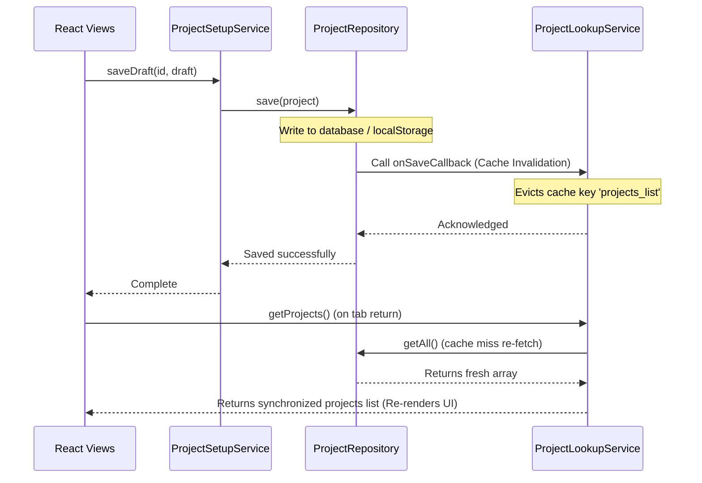

# Service & Repository Contract Catalog (API Services)

This document catalogs every service, repository, and validation contract inside the ROWAD Enterprise Platform, specifying their signatures, parameters, dependencies, side effects, and future backend REST mappings.

---

## 1. Overview
The platform organizes its business logic into discrete Service boundaries, DDD Repository boundaries, and Validator contracts. Enforcing this catalog keeps service boundaries clean and ensures consistent side-effect behaviors across views.

---

## 2. API Catalog

### 2.1 ProjectSetupService
- **Purpose**: Manages the multi-step wizard state transition checklist, draft savings, and activation triggers for projects.
- **Dependencies**: `ProjectRepository`, `ProjectActivationPolicy`, `ProjectLookupService`
- **Called By**: `ProjectSetupWizard`, `ProjectWorkspace`
- **Public Methods**:
  - `resumeDraft(projectId: string): Promise<ProjectSetupDraft>`
    - *Returns*: Draft document loaded from localStorage, or dynamically hydrated from active project aggregate if draft is evicted.
  - `saveDraft(projectId: string, draft: ProjectSetupDraft): Promise<boolean>`
    - *Returns*: `true` on successful save.
    - *Side Effects*: Writes to `ProjectRepository` which triggers cache invalidation.
  - `completeSetup(projectId: string, draft: ProjectSetupDraft): Promise<{ success: boolean; errors: string[] }>`
    - *Returns*: Validation result checking readiness score. Mutates status to `Pending Activation`.
  - `activateProject(projectId: string): Promise<{ success: boolean; errors: string[] }>`
    - *Returns*: Validation result. Promotes settings to aggregate, clears setup draft, and sets `workflowState = Active`.
- **Future FastAPI Mapping**: 
  - `GET /api/projects/{id}/setup-draft`
  - `PUT /api/projects/{id}/setup-draft`
  - `POST /api/projects/{id}/activate`

---

### 2.2 TenderAwardService
- **Purpose**: Orchestrates the conversion of a submitted/negotiating Tender into an inactive Project.
- **Dependencies**: `TenderRepository`, `ProjectRepository`, `BusinessEventRepository`, `TenderService`
- **Called By**: `AwardConfirmationModal`, `OngoingTenders`
- **Public Methods**:
  - `awardLegacyTender(tender: LegacyTender, userId: string, contractVal: number, currency: string, awardDate: string, loaRef: string, attachments?: ProjectAttachment[]): Promise<AwardTenderResult>`
    - *Returns*: Status of the award, generated project aggregate, and updated tender.
    - *Side Effects*: Persists new project aggregate, updates tender state, logs audit history.
  - `isTenderReadOnly(tender: Pick<LegacyTender, 'awardedProjectId' | 'awardStatus' | 'projectStatus'>): boolean`
    - *Returns*: `true` if tender is already awarded.
- **Future FastAPI Mapping**:
  - `POST /api/tenders/{id}/award` (Accepts JSON body matching contract value parameters, returns `{ projectId: string }`).

---

### 2.3 ProjectLookupService
- **Purpose**: Controls client-side caching of the projects portfolio list and implements lookup searches.
- **Dependencies**: `ProjectRepository` (Callbacks)
- **Called By**: `useProjects`, `ProjectList`, `ProjectWorkspace`, `TenderAwardService`
- **Public Methods**:
  - `static getInstance(): ProjectLookupService` (Singleton)
  - `getProjects(): Promise<Project[]>`
    - *Returns*: Cached array of projects.
  - `getProjectById(id: string): Promise<Project | undefined>`
    - *Returns*: Singular project from cached list.
  - `refresh(): Promise<void>`
    - *Side Effects*: Clears cached array key (`'projects_list'`) to force database re-fetch.
- **Future FastAPI Mapping**:
  - `GET /api/projects` (Cache-controlled via ETag or Redis cache invalidation on backend).

---

### 2.4 ProjectRepository
- **Purpose**: Encapsulates persistence of project aggregates, historical logs, and file metadata.
- **Dependencies**: LocalStorage / Storage engine
- **Called By**: `ProjectSetupService`, `TenderAwardService`, `ProjectLookupService`
- **Public Methods**:
  - `getAll(): Promise<Project[]>`
    - *Returns*: List of project aggregate roots.
  - `getById(id: string): Promise<Project | undefined>`
    - *Returns*: Singular project aggregate root.
  - `save(project: Project): Promise<boolean>`
    - *Side Effects*: Mutates database record, triggers `onSaveCallback` listeners.
  - `delete(id: string): Promise<boolean>`
    - *Side Effects*: Removes record, triggers callback listeners.
  - `static onSaveCallback(callback: () => void): void` (Static subscription)
- **Future FastAPI Mapping**:
  - `GET /api/projects/{id}`
  - `PUT /api/projects/{id}`
  - `DELETE /api/projects/{id}`

---

### 2.5 ProjectActivationPolicy
- **Purpose**: Authoritative rule validator deciding if a project setup checklist is eligible for completion/activation.
- **Dependencies**: None (Pure function)
- **Called By**: `ProjectSetupService`
- **Public Methods**:
  - `evaluate(project: Project, draft: any, attachments: ProjectAttachment[], requiredDocs: string[]): { activationAllowed: boolean; readinessScore: number; commercial: string; schedule: string; office: string; documents: string; errors: string[]; warnings: string[] }`
    - *Returns*: Complete activation validation report card.
- **Future FastAPI Mapping**:
  - Evaluated on backend inside `POST /api/projects/{id}/activate` route handler before database commit.

---

### 2.6 StatusPresentationService & LifecyclePresentationService
- **Purpose**: Translates technical database string states into customer-facing presentation elements (labels, colors, icons).
- **Dependencies**: None (Pure mappers)
- **Called By**: `ProjectStatusBadge`, `ProjectLifecycleBadge`, `ProjectList`
- **Public Methods**:
  - `getWorkflowStateBadge(state: string, lang: 'en'|'ar'): BadgeProperties`
  - `getStatusBadge(status: string, lang: 'en'|'ar'): BadgeProperties`
  - `getLifecycleStageBadge(stage: string, lang: 'en'|'ar'): BadgeProperties`
- **Future FastAPI Mapping**: None (Remains purely client-side UI helper).

---

### 2.7 FinancialsCalculator
- **Purpose**: Business rule calculator for sums, progress ratios, advance recovery, and currency conversions.
- **Dependencies**: None
- **Called By**: `ProjectList`, `ProjectKpiBoard`, `IPCsPanel`, `SubcontractorsPanel`
- **Public Methods**:
  - `sumAmounts(amounts: Array<{ amount: number; currency: Currency }>, target: Currency): MoneyAmount`
    - *Returns*: Combined amount in target currency using system rates.
  - `calculateFinancialProgress(project: any): number | undefined`
    - *Returns*: `undefined` (fallback for unimplemented progress engine) or percentage.
- **Future FastAPI Mapping**:
  - Shared Python calculators on backend to pre-calculate progress values during nightly cron updates.

---

## 3. Architecture Diagrams

The sequence diagram below displays how write interactions trigger cache evictions in ProjectLookupService:

---

## 4. Related Components
- **ProjectRepository**: Declares the cache invalidation hook.
- **ProjectLookupService**: Registers listener to repository callback.

---

## 5. Future Improvements
- **FastAPI OpenAPI Generation**: Automatically generate typescript interface mappers for these services when backend endpoints are formalized.
