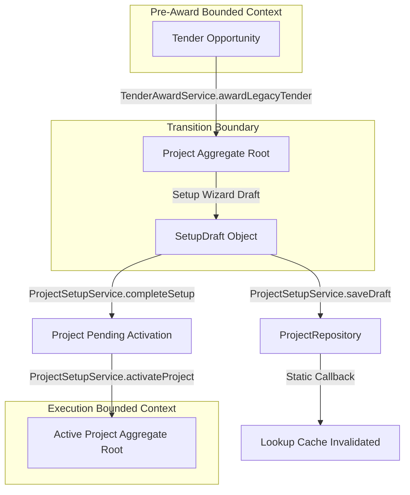

# Bounded Context Data Flow Specification

This document details the end-to-end data flow, object conversions, and service pathways within the ROWAD Enterprise Platform.

---

## 1. Overview
The platform processes opportunities through pre-award and award phases, promoting them into execution. The pipeline governs data integrity and prevents stale cached datasets.

---

## 2. End-to-End Pipeline Flow

---

## 3. Pipeline Stages & Service Catalog

### 3.1 Opportunity Phase
- **Action**: A tender is studied, estimated, and submitted.
- **Data Shape**: `Tender` aggregate.
- **Primary Service**: `TenderService` & `TenderRepository`.

### 3.2 Award Transition
- **Action**: Tender is won. Operator records award date, contract value, and LOA reference.
- **Conversion**: `TenderAwardService.awardLegacyTender()` maps the Tender data into a new Project aggregate.
- **Output**:
  - `Project.status` = `Inactive`
  - `Project.workflowState` = `Setup`
  - `Project.lifecycleStage` = `Pending Project Setup`
  - A transient setup draft is initialized in storage (`pmo_projects_setup_drafts`).
- **Primary Service**: `TenderAwardService`.

### 3.3 Project Setup & Draft Staging
- **Action**: Contracts engineers fill commercial configurations, schedule parameters, and project office assignments.
- **Data Shape**: `ProjectSetupDraft`.
- **Primary Service**: `ProjectSetupService` / `ProjectRepository.saveDraft()`. Saves invalidates the lookup cache singleton.

### 3.4 Activation Gate
- **Action**: Project Setup validation checks readiness scorecard.
- **Conversion**: `ProjectSetupService.activateProject()` executes:
  1. Deletes setup draft in storage.
  2. Promotes draft values to Project aggregate settings properties (`commercialSettings`, `calendarFoundation`, `projectOffice`).
  3. Sets `project.workflowState = Active`, `project.status = Mobilizing`, and `project.lifecycleStage = Ready for Mobilization`.
- **Primary Service**: `ProjectSetupService` & `ProjectActivationPolicy`.

### 3.5 Execution & Workspace Unlocking
- **Action**: Workspace components unlock.
- **Data Shape**: Active `Project` aggregate loaded from `ProjectLookupService.getProjects()`.
- **Primary Service**: `ProjectLookupService` (Workspace data hydrator).

---

## 4. Related Components
- **TenderAwardService**: Governs award translation rules.
- **ProjectSetupService**: Governs wizard state progression.
- **ProjectLookupService**: Feeds execution components with fresh project aggregate details.
