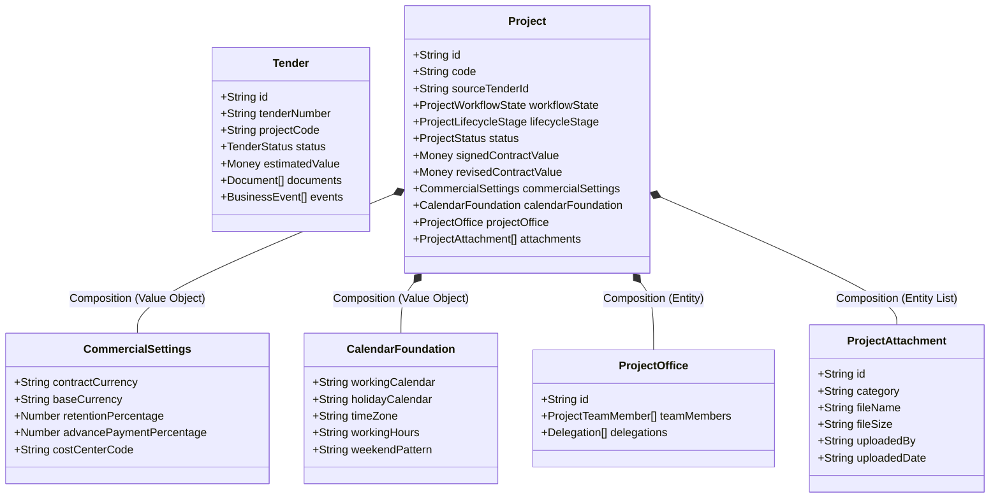

# Domain Model & DDD Aggregate Roots Specification

This document details the Domain-Driven Design (DDD) model, aggregate boundaries, entities, and value objects within the ROWAD Enterprise Platform.

---

## 1. Overview
The business logic of the Contracts Administration Department is modeled using domain aggregates. A domain aggregate is a cluster of associated objects treated as a single data transition unit. Any database read or write transaction must happen through the **Aggregate Root**.

---

## 2. DDD Boundaries & Aggregate Roots

We define two primary bounded contexts and aggregate roots:

---

## 3. Aggregate Root Specifications

### 3.1 Project Aggregate Root
The **Project** is the Single Source of Truth (SSoT) for all active operations. Every operational transaction (IPCs, VOs, Claims, NOCs, Subcontracts) must associate with a `ProjectId` and reference the Project Aggregate root.

#### Sub-Entities & Value Objects:
1. **CommercialSettings (Value Object)**:
   - *Description*: Defines commercial terms (retention rate, advance payment percentage, vat, cost center code).
   - *Ownership*: Immutable. Recreated on update.
2. **CalendarFoundation (Value Object)**:
   - *Description*: Defines execution schedule parameters (holidays, working hours, weekends).
3. **ProjectOffice (Entity)**:
   - *Description*: Identifies assigned team members and roles (PM, SM, CA) who hold responsibility for project delivery.
4. **ProjectAttachment (Entity)**:
   - *Description*: Stores metadata of physical attachments (commencement letters, contracts). Files are stored on SharePoint; only metadata is persisted.

---

### 3.2 Tender Aggregate Root
The **Tender** is the root for all pre-award bid opportunities.
- **Rules**:
  - Read-only once status transitions to `Awarded`.
  - Serves as the immutable seed source for the newly awarded Project.
  - Cannot be mutated by execution modules.

---

## 4. Lifecycle Transitions & State Definitions

A project transitions through a series of logical states defined by three state variables:

| Stage Name | Workflow State | Operational Status | Lifecycle Stage | Allowed operations |
| :--- | :--- | :--- | :--- | :--- |
| **Tender Opportunity** | Pre-Award | Active/Submitted | Pre-Award | Price pricing, upload study files |
| **Pending Setup** | Setup | Inactive | Pending Project Setup | Fill Commercial, Schedule, Office |
| **Pending Activation** | Pending Activation | Inactive | Pending Project Setup | Validate checklist, approve draft |
| **Ready for Mobilization**| Active | Mobilizing | Ready for Mobilization| Load calendar, request advance payment |
| **Execution** | Active | Active | Execution | Raise IPCs, submit VOs, claims |
| **Closing** | Active | Completed/Closed | Closing | Final accounts, handovers |
| **Archived** | Archived | Archived | Archived | Read-only reporting audits |

---

## 5. Persistence Boundaries
- **Project Master Table (`pmo_projects_master`)**: Holds the complete Project aggregate schema as a single JSON object.
- **Event Logs Table (`pmo_business_events`)**: Chronological audit list of transitions.
- **Attachments Table (`pmo_project_attachments`)**: Holds files metadata.

---

## 6. Future Improvements
- **Schema Strictness**: Map database columns explicitly in PostgreSQL rather than storing JSON blobs, enabling sql index queries on sub-properties like `commercialSettings.costCenterCode`.
