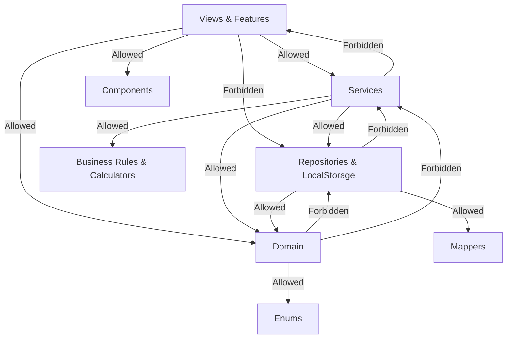

# Folder Structure & Dependency Rules Specification

This document details the directory structure of the ROWAD Enterprise Platform and establishes strict import boundaries to prevent architectural erosion.

---

## 1. Overview
To maintain a clean decoupled structure, the codebase enforces strict boundaries between layers. The directory hierarchy separates UI rendering from state orchestration and database persistence.

---

## 2. Directory Map (`src/` Tree)

```
src/
├── domain/            # DDD Aggregates, Entities, and Value Objects.
├── services/          # Application orchestration services coordinating flow.
├── repositories/      # Storage CRUD adapters and persistence boundaries.
├── business-rules/    # Pure, stateless mathematical calculation engines.
├── validators/        # Input and compliance validators.
├── mappers/           # Schema translates (persistence shape ↔ domain shape).
├── features/          # Modular React components grouped by business modules.
├── components/        # Reusable shared UI widgets (buttons, badges).
├── hooks/             # Shared React state and data hooks.
├── enums/             # System-wide enum definitions.
├── constants/         # Static configuration constants.
├── seed/              # System bootstrapping data.
├── views/             # Route-level page layouts.
```

---

## 3. Allowed and Forbidden Imports Matrix

To prevent circular dependency graphs, the following import rules are strictly enforced:



### Import Rules Breakdown

| Directory | Allowed Imports | Forbidden Imports | Why? |
| :--- | :--- | :--- | :--- |
| `src/domain/` | `src/enums/`, `src/constants/` | `src/services/`, `src/repositories/`, `src/features/` | Domain represents core business rules; it must remain completely decoupled from DB and UI framework details. |
| `src/services/` | `src/domain/`, `src/repositories/`, `src/business-rules/`, `src/validators/` | `src/features/`, `src/views/`, React state hooks (`useState`) | Services orchestrate workflows; they must not couple to visual rendering layers. |
| `src/repositories/` | `src/domain/`, `src/mappers/`, `src/enums/` | `src/services/`, `src/features/` | Repositories handle storage adapter functions only. |
| `src/business-rules/` | `src/enums/`, `src/domain/` | `src/services/`, `src/repositories/`, `src/features/` | Calculators must remain pure, stateless side-effect-free helpers. |
| `src/features/` | `src/services/`, `src/components/`, `src/domain/` | Direct repository database calls, `localStorage` | UI must retrieve and submit data only through Orchestration Services. |

---

## 4. Examples of Forbidden Imports

* **Circular dependency error**:
  ```typescript
  // Inside src/repositories/ProjectRepository.ts
  import { ProjectLookupService } from '../services/ProjectLookupService'; // FORBIDDEN!
  ```
  *Solution*: Use static repository hooks (e.g., `onSaveCallback`) to notify listeners without importing the service directly.

* **Layer bypass error**:
  ```typescript
  // Inside src/features/projects/components/ProjectList.tsx
  import { ProjectRepository } from '../../../repositories/ProjectRepository'; // FORBIDDEN!
  ```
  *Solution*: Fetch and mutate records only through the `useProjects` hook or `ProjectLookupService`.

---

## 5. Future Improvements
- **ESLint Import Bounds**: Write custom eslint rule configurations using `eslint-plugin-import` to fail builds automatically if forbidden import paths are detected.
