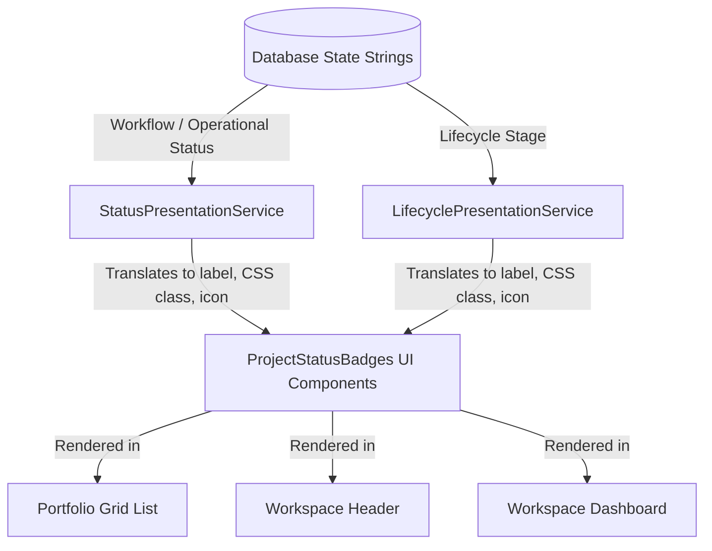

# Presentation Mappers & Reusable Badges Specification

This document details the centralized presentation services and reusable badge components designed to format project states and statuses across the ROWAD Enterprise Platform.

---

## 1. Overview
Previously, styling classes (e.g. `bg-emerald-50 text-emerald-600`) and bilingual status name mappings (e.g. `Active` ↔ `نشط`) were duplicated across multiple components (Portfolio Grid, Workspace header, Dashboard cards). This duplication caused visual drift, where the same project status rendered with different colors or terms on different screens.

---

## 2. Centralization Design

To guarantee visual consistency, we decoupled presentation formatting from React views by creating a dedicated presentation layer:

---

## 3. Component Details

### 3.1 StatusPresentationService
- **Purpose**: Translates operational statuses and workflow states.
- **Key Methods**:
  - `getWorkflowStateBadge(state, lang)`: Maps states (`Draft`, `Setup`, `Pending Activation`, `Active`, `Suspended`, `Archived`) to labels, colors, and Lucide icons.
  - `getStatusBadge(status, lang)`: Maps operational statuses (`Inactive`, `Mobilizing`, `Active`, `Suspended`, `Completed`, `Closed`, `Archived`) to CSS classes.

### 3.2 LifecyclePresentationService
- **Purpose**: Translates lifecycle stages (`Pre-Award`, `Pending Project Setup`, `Ready for Mobilization`, `Execution`, `Closing`, `Archived`) to design tokens.

### 3.3 ProjectStatusBadges (React Components)
Exported from [ProjectStatusBadges.tsx](file:///d:/M.Gamal/Learn/Projects/Rowad-v1-main/src/components/ProjectStatusBadges.tsx):
1. **`<ProjectWorkflowStateBadge />`**: Renders workflow state pill with appropriate icon and class.
2. **`<ProjectStatusBadge />`**: Renders operational status pill.
3. **`<ProjectLifecycleBadge />`**: Renders lifecycle stage badge.

---

## 4. Why Presentation Logic is Centralized
1. **Single Source of Truth**: Any modification to a status label (English or Arabic) or color palette is applied in a single service file.
2. **Dry Principle**: Elimination of duplicate switch/ternary expressions in React view files.
3. **Visual Consistency**: Ensures a project marked as "Mobilizing" displays the same badge style on the grid, in the header, and on the dashboard.

---

## 5. Future Improvements
- **Theme Support**: Extend presentation mappers to support dark/light theme overrides for HSL tailored badges.
