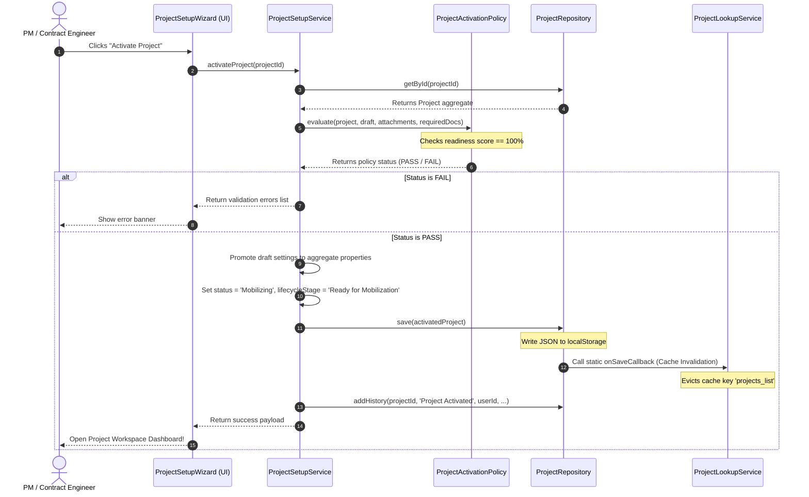

# Project Activation Pipeline Specification

This document details the Project Activation pipeline, the policy rules checklist, cache invalidations, and audit logging sequences.

---

## 1. Overview
Project Activation is the definitive state transition that shifts a project from its inactive setup phase to active execution. The activation pipeline is designed as a secure transactional boundary preventing unconfigured projects from cluttering the execution portfolio.

---

## 2. Activation Architecture Sequence

The following sequence diagram details the interaction between components when activating a project:

---

## 3. Core Components

### 3.1 ProjectActivationPolicy
- **Role**: Bounded validator verifying setup compliance rules.
- **Rules**:
  - *Commercial*: Validates base currency, retention %, advance %, and Cost Center format.
  - *Schedule*: Validates start date, completion date, working hours, and weekend pattern.
  - *Office*: Verifies PM, Site Manager (SM), and Contract Administrator (CA) assignments.
  - *Documents*: Matches project attachments and verified draft categories against required compliance list.

### 3.2 ProjectSetupService
- **Role**: Coordinates the domain aggregates and persistence repositories. Promotes settings and handles state transitions.

### 3.3 Cache Invalidation Adapter
- **Trigger**: Every write operation to `ProjectRepository.save()` invokes `ProjectRepository.onSaveCallback`.
- **Efficacy**: The `ProjectLookupService` constructor registers a subscriber to this static callback, evicting the lookup cache dynamically without direct dependency injection.

---

## 4. Activation Logging & Audit Trail
For compliance audits, every project activation writes an immutable entry to the project history logs:
- **Action**: `Project Activated`
- **User**: The active operator's user identifier.
- **Remarks**: Detailed summary of settings promoted (e.g. `"Project activated. Promoted commercial cost center CC-NEOM-09, calendar Egypt Holidays, and project office PM: Eng. Khaled"`).
- **Module**: `Project Setup`

This history log guarantees that system modifications are transparently tracked.

---

## 5. Future Improvements
- **Automatic Email Notifications**: Introduce an event listener to the repository save callbacks to automatically dispatch email notifications to the assigned PM and SM upon project activation.
