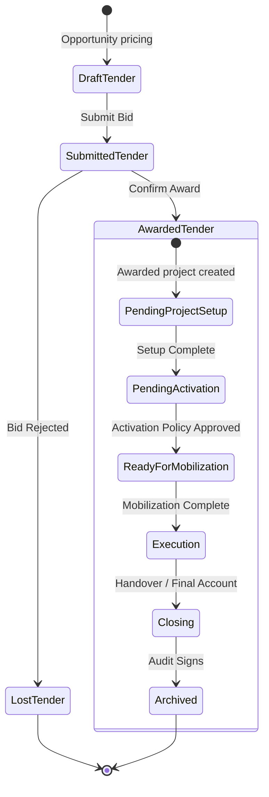

# Project Lifecycle & State Transitions Specification

This document details the state machine of the ROWAD Enterprise Platform, specifying workflow states, operational statuses, locked execution panels, and criteria for transition.

---

## 1. Overview
A Project starts as a Tender pre-award bid opportunity and moves through setup verification to execution, closing, and archiving. The platform separates:
1. **Workflow State**: Controls visual panel unlocking (e.g. `Setup`, `Active`, `Archived`).
2. **Operational Status**: Represents the current business status (e.g. `Inactive`, `Mobilizing`, `Active`, `Suspended`, `Completed`, `Closed`, `Archived`).
3. **Lifecycle Stage**: Represents the department timeline stage (e.g. `Pre-Award`, `Pending Project Setup`, `Ready for Mobilization`, `Execution`, `Closing`, `Archived`).

---

## 2. State Machine Diagram

The following state diagram displays the transition flow across stages:

---

## 3. Detailed Lifecycle Stage Catalog

### 3.1 Pre-Award (Tender Stage)
- **Workflow State**: `Draft` / `Submitted` / `Negotiation`
- **Operational Status**: `Pre-Award`
- **Lifecycle Stage**: `Pre-Award`
- **Allowed Operations**: Price pricing elements, study drawings, update timeline offsets, submit proposal bids.
- **Locked Modules**: All Project Workspace panels (IPCs, VOs, Claims, NOCs, Subcontracts, WBS, Meetings).
- **Entry Conditions**: Bid opportunity initialized.
- **Exit Conditions**: Tender status set to `Awarded` via the `TenderAwardService`.

---

### 3.2 Pending Project Setup
- **Workflow State**: `Setup`
- **Operational Status**: `Inactive`
- **Lifecycle Stage**: `Pending Project Setup`
- **Allowed Operations**: Setup Center Wizard steps (Commercial settings, Calendar, team assignments, verify baseline documents).
- **Locked Modules**: All execution panels (IPCs, VOs, Claims, NOCs, Subcontractors, WBS, Meetings).
- **Entry Conditions**: Tender awarded. New project aggregate initialized.
- **Exit Conditions**: Form steps completed, and saved draft validated successfully through `ProjectSetupService.completeSetup()`.

---

### 3.3 Pending Activation
- **Workflow State**: `Pending Activation`
- **Operational Status**: `Inactive`
- **Lifecycle Stage**: `Pending Project Setup`
- **Allowed Operations**: View read-only setup summary, check policy scorecard, execute activation command.
- **Locked Modules**: All execution panels.
- **Entry Conditions**: Setup completed and validated.
- **Exit Conditions**: Activation Policy approved (100% readiness score) and activated via `ProjectSetupService.activateProject()`.

---

### 3.4 Ready for Mobilization
- **Workflow State**: `Active`
- **Operational Status**: `Mobilizing`
- **Lifecycle Stage**: `Ready for Mobilization`
- **Allowed Operations**: Full project execution panels unlocked. Register mobilization checklist items, coordinate kickoff meetings.
- **Locked Modules**: Setup Center is closed/evicted.
- **Entry Conditions**: Activation Policy approved. Settings promoted to aggregate.
- **Exit Conditions**: Mobilization period completed, site kickoff recorded.

---

### 3.5 Execution
- **Workflow State**: `Active`
- **Operational Status**: `Active`
- **Lifecycle Stage**: `Execution`
- **Allowed Operations**: Add, Edit, and process IPCs, Variation Orders, Claims, NOCs, Subcontracts, WBS revisions, Meetings, Documents.
- **Locked Modules**: Setup Center.
- **Entry Conditions**: Mobilization complete.
- **Exit Conditions**: Handovers signed, final certificate generated.

---

### 3.6 Closing
- **Workflow State**: `Active`
- **Operational Status**: `Completed` / `Closed`
- **Lifecycle Stage**: `Closing`
- **Allowed Operations**: Process final accounts, document defect liability lists, close subcontracts.
- **Locked Modules**: Add new VOs or claims (read-only logs).
- **Entry Conditions**: Project works completed.
- **Exit Conditions**: Department signature signs closing.

---

### 3.7 Archived
- **Workflow State**: `Archived`
- **Operational Status**: `Archived`
- **Lifecycle Stage**: `Archived`
- **Allowed Operations**: Read-only lookup query audits.
- **Locked Modules**: All write/edit operations blocked.
- **Entry Conditions**: Project closed.
- **Exit Conditions**: None. Archived projects are frozen and never reopened.

---

## 4. Locked Panels Reference Matrix

| Panel | Setup Stage | Pending Activation | Active / Mobilizing | Archived |
| :--- | :--- | :--- | :--- | :--- |
| **Setup Center** | **Unlocked** | **Read-Only** | Evicted / Hidden | Hidden |
| **Dashboard** | Unlocked (Setup status) | Unlocked | Unlocked (Active KPIs)| Unlocked (Read-only) |
| **IPCs** | **Locked** | **Locked** | **Unlocked** | Read-Only |
| **VOs** | **Locked** | **Locked** | **Unlocked** | Read-Only |
| **Claims** | **Locked** | **Locked** | **Unlocked** | Read-Only |
| **Meetings** | **Locked** | **Locked** | **Unlocked** | Read-Only |
| **Subcontractors**| **Locked** | **Locked** | **Unlocked** | Read-Only |
| **Documents** | **Locked** | **Locked** | **Unlocked** | Read-Only |
| **Settings** | **Locked** | **Locked** | **Unlocked** | Read-Only |
