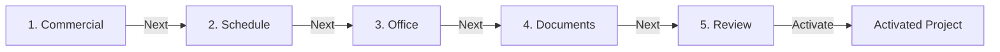

# Project Setup Center Specification

This document details the configuration, draft saving, form validations, and activation promotion rules implemented in the Project Setup Center.

---

## 1. Overview
The Setup Center wizard acts as a staging gate for awarded projects. When a Tender is awarded, the resulting Project aggregate has no duration dates, no assigned Site Manager, and no commercial currency rates. The Project Setup Center gathers this metadata and validates it before project activation.

---

## 2. Setup Steps & Validation Rules



### 2.1 Step 1: Commercial Settings
- **Fields**: Employer Name, Contract Type, Base Currency, Contract Currency, exchange rates, retention %, advance payment %, VAT %, cost center code.
- **Validation Rules**:
  - *Employer Name*: Required, non-empty, minimum 3 characters.
  - *Contract Type*: Required (e.g. `Lump Sum`, `Measurement`, `Cost Plus`).
  - *VAT Percentage*: Must be between 0% and 100% (defaults to 15%).
  - *Retention Percentage*: Must be between 0% and 100% (defaults to 10%).

### 2.2 Step 2: Schedule Settings
- **Fields**: Start Date, Completion Date, contract duration (days), mobilization duration (days), weekend pattern, holiday calendar, working hours.
- **Validation Rules**:
  - *Holiday Calendar*: Required.
  - *Working Hours*: Required (e.g. `08:00-17:00`).
  - *Start Date / Completion Date*: Start date must precede completion date.

### 2.3 Step 3: Project Office Team
- **Fields**: Assisting team members and assigned roles (Project Manager, Site Manager, Contract Administrator, Planning Engineer, Cost Controller).
- **Validation Rules**:
  - *Project Manager (PM)*: Must be assigned with a valid employee identifier.
  - *Site Manager (SM)*: Must be assigned.
  - *Contract Administrator (CA)*: Must be assigned.

### 2.4 Step 4: Documents Checklist
- **Fields**: Verify mandatory pre-execution compliance documents.
- **Validation Rules**:
  - *Checklist Categories*: Letter of Award, Signed Contract, Commencement Letter, BOQ, IFC Drawings, Baseline Schedule must be verified (checked or attached as metadata).

### 2.5 Step 5: Review & Activation
- **Readiness Score Calculation**:
  - Checks compliance rules across Commercial, Schedule, Office, and Documents.
  - Returns a score (0% to 100%) and a list of blocking errors.
  - Score must be 100% to enable the activation action button.

---

## 3. Draft Hydration & Autosave

### 3.1 Draft Hydration Protocol (Sprint 4A.3 Correction)
When a project is activated, its setup draft document is evicted from database persistence to save space. If a user subsequently reopens the Setup Center page, the service hydrator automatically runs:

```
If setupDraft exists:
    Hydrate from setupDraft
Else (Project is already Active):
    Construct a draft object dynamically from the persisted Project aggregate root:
    - commercial: Hydrate from project.commercialSettings, project.employer, project.contractType
    - schedule: Hydrate from project.startDate, project.contractDurationDays, project.calendarFoundation
    - office: Hydrate from project.projectOffice
    - documents: Hydrate using verified doc list
```
This guarantees UI hydration consistency even after draft eviction.

### 3.2 Autosave Behavior
The wizard autosaves on step transitions or clicking "Save Draft". It writes directly to `ProjectRepository.saveDraft()`, which updates the project aggregate carrier property and invalidates the lookup service.

---

## 4. Activation Promotion Sequence
When the project is promoted to `Active`:
1. The transient `SetupDraft` is deleted.
2. The settings parameters inside the draft are promoted to the canonical project aggregate properties:
   - `project.commercialSettings`
   - `project.calendarFoundation`
   - `project.projectOffice`
   - `project.startDate`
   - `project.completionDate`
3. `project.isSetupComplete` is set to `true`.
4. `project.workflowState` is set to `Active`.
5. `project.status` is set to `Mobilizing`.
6. `project.lifecycleStage` is set to `Ready for Mobilization`.
7. An audit history log entry is appended to history.

---

## 5. Future Improvements
- **Integration with Employee Master**: Connect Project Office dropdown selectors to the HR employee database instead of raw text fields.
