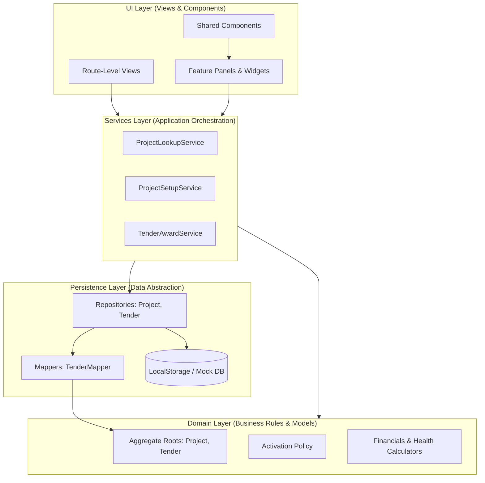
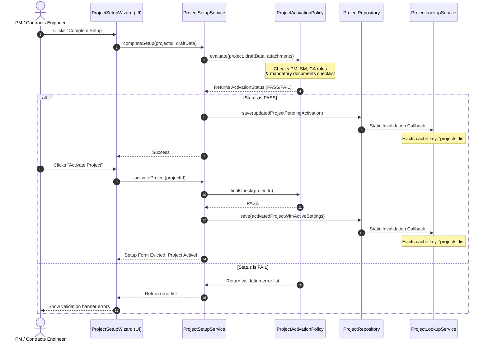

# System Architecture Specification

This document details the core architectural layout of the ROWAD Enterprise Platform, describing the clean architecture layers, domain boundaries, and data flow.

---

## 1. Overview
The ROWAD Enterprise Platform is designed as a modular **React 19 + TypeScript + Vite** application applying **Clean Architecture** and **Domain-Driven Design (DDD)** principles. Since the application currently runs in a client-side execution container (local storage seed), the architecture decouples core business logic and domain validation from React components and mock storage databases, preparing the codebase for subsequent backend migration.

---

## 2. Purpose
The primary purpose of this architecture is to enforce the **Single Source of Truth (SSoT)** rule for projects, isolate business decisions (calculators, policies, and validators) from presentation components, and prevent the system from degrading into a spaghetti code model. This architecture guarantees:
- **Testability**: Core business rules can be verified in node/jest tests without browser DOM hydration.
- **Backend Portability**: Repositories can transition from LocalStorage to FastAPI endpoints without mutating UI layers.
- **Maintainability**: Clear separation of responsibilities between data translation (Mappers), validation (Policies), orchestration (Services), and views.

---

## 3. Architecture Layers & Diagram

The system is organized into five isolated layers. The flow of dependencies is strictly top-down. Lower layers (Domain, Repositories) must never import from upper layers (UI, Features).

### Layer Responsibilities

| Layer | Path | Allowed Imports | Forbidden Imports |
| :--- | :--- | :--- | :--- |
| **UI / Views** | `src/views/` | `src/services/`, `src/components/`, `src/domain/` | Any repository directly, storage |
| **Features** | `src/features/` | `src/services/`, `src/components/`, `src/domain/` | Any repository directly, storage |
| **Services** | `src/services/` | `src/domain/`, `src/repositories/`, `src/business-rules/` | UI components, React hooks |
| **Domain** | `src/domain/` | Only other domain models, constants, enums | Services, Repositories, UI components |
| **Repositories** | `src/repositories/` | `src/domain/`, `src/mappers/`, `src/enums/` | UI, Services, React state |

---

## 4. Architectural Workflows & Examples

### Setup & Activation Execution Sequence
The following sequence diagram demonstrates the flow of data when a project setup is completed and activated:

---

## 5. Related Components
- **ProjectLookupService**: Controls reading of cached project arrays and invalidates on write.
- **ProjectSetupService**: Controls state transitions from Draft setup through compliance checks and activation.
- **ProjectRepository**: Abstract boundary encapsulating mock persistence and invalidation triggers.
- **ProjectStatusBadges**: Centralized badge rendering using status translation mappings.

---

## 6. Future Improvements
- **FastAPI Core Integration**: Transition repository methods from localStorage to async HTTP fetch transactions against PostgreSQL schema routes.
- **Materialized Views**: Introduce service-level caching for high-load aggregated views (SPR read model) using materialized tables to avoid in-memory reductions.
- **System Event Queue**: Implement a pub-sub model for repository mutations to trigger dashboard counters and notification dispatches asynchronously.
