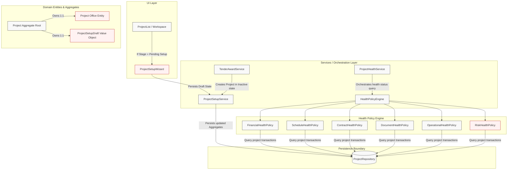

# ROWAD Enterprise Platform — Project Award & Setup Architecture Refinement
**Module**: Pre-Award to Project Setup (Sprint 4 Official Implementation Baseline)  
**Status**: Approved Architecture Specification  

---

## 1. Updated Architecture Diagram

The revised architecture introduces the **Project Office** entity, the **RiskHealthPolicy** module, and the **ProjectSetupDraft** persistence container.



---

## 2. Updated Domain Model

The updated `Project` aggregate root in [Project.ts](file:///d:/M.Gamal/Learn/Projects/Rowad-v1-main/src/domain/projects/Project.ts) encapsulates `ProjectOffice` and `ProjectSetupDraft`.

```typescript
export type ProjectLifecycleStage =
  | 'Pending Project Setup'   // Newly awarded, setup draft in progress
  | 'Ready for Mobilization'  // Setup completed, documents verified, mobilization active
  | 'Execution'               // Official commencement date reached, active site operations
  | 'Substantial Completion'  // Primary handover complete, DLP active
  | 'Final Completion'        // DLP complete, final account signed
  | 'Closed';                 // Administrative close-out finished, archive read-only

export interface Project extends BaseEntity {
  // Existing SSoT identification
  code: string;
  sourceTenderId?: string;
  sourceTenderNumber?: string;
  awardedAt?: string;
  nameEn: string;
  nameAr?: string;
  client: string;
  employer: string;
  consultant: string;
  mainContractor: string;
  contractType: string;
  currency: string;
  country: string;
  city: string;

  // Commercial & Financial Baselines
  signedContractValue: number;
  revisedContractValue: number;
  approvedVariationTotal: number;

  // Owned Entities (DDD Aggregation)
  projectOffice: ProjectOffice;           // Encapsulates team, roles, and delegations
  setupDraft?: ProjectSetupDraft;          // Retains step states until activation

  // Timeline (Legal baseline vs. Schedule Forecast)
  startDate: string;                  // Commencement Date (ISO YYYY-MM-DD)
  contractDurationDays: number;       // Calendar days duration
  approvedEotDays: number;            // Total approved EOT days
  contractualCompletionDate: string;  // Calculated: startDate + contractDurationDays + approvedEotDays
  forecastCompletionDate?: string;    // Sourced from Primavera forecast imports

  // Mobilization Parameters
  mobilizationPeriodDays: number;
  mobilizationDate: string;

  // Lifecycle
  lifecycleStage: ProjectLifecycleStage;
  status: 'Active' | 'Inactive' | 'Completed' | 'Closed';
  isSetupComplete: boolean;
  
  // Settings & Audit
  settings?: ProjectSettings;
}
```

---

## 3. Project Office Model

The `ProjectOffice` model decouples employee metadata and org-chart rules from the primary `Project` root, creating a clean boundary for future integrations.

```typescript
export interface ProjectTeamMember {
  roleId: string;
  employeeId?: string;    // References future Employee Master ID
  employeeName: string;   // Text display fallback
  assignedAt: string;
}

export interface ProjectDelegation {
  id: string;
  fromEmployeeId: string;
  toEmployeeId: string;
  roleId: string;
  startDate: string;      // ISO Date
  endDate: string;        // ISO Date
  isActive: boolean;
  remarks?: string;
}

export interface DistributionList {
  id: string;
  listName: string;       // e.g. "Site QA/QC Distribution"
  memberIds: string[];    // References Employee IDs
  isActive: boolean;
}

export interface ApprovalStep {
  sequence: number;
  roleId: string;         // e.g. "ContractsManager" -> "ExecutiveDirector"
  slaDays: number;        // Escalation threshold
}

export interface ApprovalMatrixRule {
  id: string;
  module: 'IPC' | 'VO' | 'Claim' | 'Document' | 'NOC';
  thresholdAmount?: number; // Null implies all amounts
  approvalSteps: ApprovalStep[];
}

export interface ProjectOffice {
  id: string;
  projectId: string;
  teamMembers: ProjectTeamMember[];
  delegations: ProjectDelegation[];
  distributionLists: DistributionList[];
  approvalMatrix: ApprovalMatrixRule[];
}
```

---

## 4. Updated Health Policy Engine

The engine is expanded with a sixth module: **RiskHealthPolicy**. This policy evaluates the future Risk Register module transactions to establish project contingency levels.

```
                  [ProjectHealthService] (Orchestrator)
                            │
                            ▼
                  [HealthPolicyEngine] (Evaluator)
                            │
  ┌───────────────┬─────────┴───────┬────────────────┬───────────────┐
  ▼               ▼                 ▼                ▼               ▼
Financial      Schedule          Contract         Document      Operational
Health         Health            Health           Health        Health
Policy         Policy            Policy           Policy        Policy
  │               │                 │                │               │
  └───────────────┴─────────┬───────┴────────────────┴───────────────┘
                            ▼
                     [RiskHealthPolicy]
```

### RiskHealthPolicy Rules Specification
* **Inputs**: Risk Registry array (`ProjectRisk[]`), probability matrices, mitigation timelines.
* **Health Level Evaluation Rules**:
  * If `!isSetupComplete` -> returns `Not Started`.
  * If no risks are registered -> returns `Unknown` (unassessed).
  * If any risk is flagged as **Escalated** to executive board -> returns `Critical`.
  * If a **Critical** or **High** risk has an overdue mitigation action item -> returns `Critical`.
  * If a High risk is unmitigated (no active action plan linked) -> returns `Warning`.
  * If all risks are mitigated and score is within the project threshold -> returns `Healthy`.

---

## 5. Activation Gate Architecture

Before transitioning a project to `'Ready for Mobilization'` or `'Execution'`, the **ProjectActivationGate** validates Dates, Mandatory Roles, Documents, and **Commercial Readiness**:

```typescript
export interface CommercialReadinessConfig {
  currency: string;               // Must be validated ISO code
  retentionPercentage: number;     // Checked range: 0% to 20%
  advancePaymentPercentage: number;// Checked range: 0% to 30%
  performanceBondNumber: string;   // Required bond reference
  performanceBondAmount: number;   // Must equal: contractValue * (bond% / 100)
  performanceBondExpiry: string;   // ISO Date, must exceed contractualCompletionDate
  vatPercentage: number;           // Standard VAT config
  paymentCreditPeriodDays: number; // e.g. 45 days terms
  costCenterCode: string;          // Mapped finance system cost code
}

export class ProjectActivationGate {
  public static validate(
    project: Project, 
    docs: ProjectDocument[], 
    comm: CommercialReadinessConfig
  ): string[] {
    const errors: string[] = [];

    // 1. Core Timeline Dates Checklist
    if (!project.startDate) errors.push('Commencement Date is required.');
    if (!project.contractDurationDays || project.contractDurationDays <= 0) {
      errors.push('Contract duration in days is required.');
    }

    // 2. Mandatory Org Roles Checklist
    const hasPM = project.projectOffice.teamMembers.some(t => t.roleId === 'PM');
    const hasSM = project.projectOffice.teamMembers.some(t => t.roleId === 'SM');
    const hasCA = project.projectOffice.teamMembers.some(t => t.roleId === 'CA');
    if (!hasPM) errors.push('Mandatory Project Team Role "Project Manager" is unassigned.');
    if (!hasSM) errors.push('Mandatory Project Team Role "Site Manager" is unassigned.');
    if (!hasCA) errors.push('Mandatory Project Team Role "Contract Administrator" is unassigned.');

    // 3. Document Readiness Checklist
    const mandatoryDocs = ['Signed Contract', 'Letter of Award', 'Commencement Letter', 'BOQ', 'IFC Drawings', 'Baseline Schedule'];
    mandatoryDocs.forEach(cat => {
      if (!docs.some(d => d.category === cat)) {
        errors.push(`Activation Gate: Mandatory document type "${cat}" is missing.`);
      }
    });

    // 4. Commercial Readiness Checklist
    if (!comm.currency || comm.currency.length !== 3) errors.push('Invalid Currency ISO code.');
    if (comm.retentionPercentage < 0 || comm.retentionPercentage > 20) errors.push('Retention % must be between 0 and 20.');
    if (comm.advancePaymentPercentage < 0 || comm.advancePaymentPercentage > 30) errors.push('Advance % must be between 0 and 30.');
    if (!comm.performanceBondNumber) errors.push('Performance Bond Number is missing.');
    if (comm.performanceBondAmount <= 0) errors.push('Performance Bond Amount must be positive.');
    if (!comm.costCenterCode) errors.push('Enterprise Cost Center Code mapping is required.');

    return errors;
  }
}
```

---

## 6. Enterprise Permission Matrix

To establish a future-proof RBAC specification, project workspace modules are regulated by action-level matrix tables across project lifecycles:

*Permissions Key: **V** (View), **C** (Create), **E** (Edit), **Ap** (Approve), **Ar** (Archive), **D** (Delete), **Ad** (Admin)*

### A. Stage: Pending Project Setup (Drafting State)
| Module / Tab | V | C | E | Ap | Ar | D | Ad | Notes |
|---|---|---|---|---|---|---|---|---|
| Overview | ✓ | ✗ | ✗ | ✗ | ✗ | ✗ | ✗ | Sourced from Tender data only. |
| Documents | ✓ | ✓ | ✓ | ✗ | ✗ | ✓ | ✗ | Open only for mandatory activation docs upload. |
| Meetings | ✓ | ✓ | ✓ | ✗ | ✗ | ✗ | ✗ | Kick-off and prep meetings. |
| WBS | ✓ | ✓ | ✓ | ✗ | ✗ | ✗ | ✗ | Baseline prep. |
| Project Setup | ✓ | ✓ | ✓ | ✓ | ✗ | ✗ | ✓ | Wizard Draft writing active. |
| IPC / VO / Claims | ✗ | ✗ | ✗ | ✗ | ✗ | ✗ | ✗ | Completely Locked. |
| NOC / Subcontracts| ✗ | ✗ | ✗ | ✗ | ✗ | ✗ | ✗ | Completely Locked. |

### B. Stage: Ready for Mobilization (Site Prep)
| Module / Tab | V | C | E | Ap | Ar | D | Ad | Notes |
|---|---|---|---|---|---|---|---|---|
| Overview / Setup | ✓ | ✗ | ✓ | ✗ | ✗ | ✗ | ✗ | Settings updates allowed. |
| Documents / Meetings| ✓ | ✓ | ✓ | ✗ | ✓ | ✗ | ✗ | Standard usage. |
| WBS | ✓ | ✗ | ✗ | ✗ | ✗ | ✗ | ✗ | Baseline schedule locked. |
| NOC Permits | ✓ | ✓ | ✓ | ✓ | ✗ | ✗ | ✗ | Active applications. |
| Subcontracts | ✓ | ✓ | ✓ | ✗ | ✗ | ✗ | ✗ | Procurement team onboarding. |
| IPC / VO / Claims | ✗ | ✗ | ✗ | ✗ | ✗ | ✗ | ✗ | Locked until Execution starts. |

### C. Stage: Execution (Active Operations)
| Module / Tab | V | C | E | Ap | Ar | D | Ad | Notes |
|---|---|---|---|---|---|---|---|---|
| IPC Accounts | ✓ | ✓ | ✓ | ✓ | ✓ | ✗ | ✗ | Invoicing active. |
| Variation Orders | ✓ | ✓ | ✓ | ✓ | ✗ | ✗ | ✗ | Variations active. |
| Claims | ✓ | ✓ | ✓ | ✓ | ✗ | ✗ | ✗ | Claims active. |
| WBS / Setup | ✓ | ✗ | ✓ | ✗ | ✗ | ✗ | ✓ | Admin configurations allowed. |
| Documents / Meetings| ✓ | ✓ | ✓ | ✓ | ✓ | ✓ | ✓ | Unlocked. |

### D. Stage: Closed (Read-Only Archive)
| Module / Tab | V | C | E | Ap | Ar | D | Ad | Notes |
|---|---|---|---|---|---|---|---|---|
| All Modules | ✓ | ✗ | ✗ | ✗ | ✗ | ✗ | ✗ | All modification actions blocked. |

---

## 7. Project Setup Draft Lifecycle

To prevent loss of work during administrative configuration, the **ProjectSetupDraft** value object persists setup progress:

```typescript
export interface ProjectSetupDraft {
  projectId: string;
  currentStep: number;            // Current step index (1 to 5)
  completedSteps: number[];       // Array of completed indices (e.g. [1, 2])
  lastSaved: string;              // ISO String
  draftTimestamp: number;         // Date.now() representation
  validationSnapshot: {
    stepId: number;
    isValid: boolean;
    missingFields: string[];
  }[];
  dataPayload: {
    commercial?: Partial<CommercialReadinessConfig>;
    schedule?: {
      startDate?: string;
      contractDurationDays?: number;
      mobilizationPeriodDays?: number;
    };
    team?: ProjectTeamMember[];
    documents?: string[];         // Array of uploaded document IDs
  };
}
```

### Setup Draft State Machine
1. **Instantiation**: `TenderAwardService` sets `setupDraft` to an empty payload on Project award.
2. **Persistence Loop**: The UI updates the `setupDraft` structure in LocalStorage on every step change. 
3. **Synchronization**: On clicking "Save Draft", `ProjectSetupService` commits the draft payload to the backend database.
4. **Resumption**: When the workspace reloads, the client checks if `lifecycleStage === 'Pending Project Setup'`. If true, it retrieves `setupDraft`, hydrates the form state, and focuses `currentStep`.
5. **Purge**: On successful project activation, the `setupDraft` attribute is deleted from the `Project` model.

---

## 8. Future Integration Matrix

The proposed architecture is validated for forward-compatibility to prevent future design revisions:

| Future Module | Integration Point | DB Impact | Code Impact | Resolution Strategy |
|---|---|---|---|---|
| **Employee Master** | `ProjectTeamMember.employeeId` | Foreign Key constraints to `Employees` | Replaces string text dropdowns with entity autocomplete queries | Supported via dynamic role map; no domain structure edits required. |
| **Correspondence** | `ProjectOffice.distributionLists` | Links Letters to distribution models | Add `letters` tables referencing `ProjectId` | Distribution routes read from `ProjectOffice` directly. |
| **Workflow Engine** | `ProjectOffice.approvalMatrix` | Links tasks to approval matrix sequences | Links step outcomes to state transitions | Evaluator queries matrix rules inside `ProjectOffice` model. |
| **Notifications** | `ProjectOffice` distribution lists | None | Notification service reads employee mappings | Handled by reading mail/Teams addresses from mapped list arrays. |
| **Risk Register** | `RiskHealthPolicy` | Creates `ProjectRisk` table | `RiskHealthPolicy` queries risk statuses | Decoupled; policy executes queries without touching project domain logic. |
| **Power BI / DB** | PostgreSQL Views | Replicate transactional database | Mapped view schemas to read JSON representations | Mappers extract clean schemas for backend ingestion. |

---

## 9. Updated ADR Recommendation

We recommend finalizing **ADR-013: Project Setup Lifecycle & Policy-Based Health Engine**:

* **Decisions**:
  1. Introduce **Project Office** as an owned entity under the `Project` aggregate root to hold organizational settings, approval metrics, and distribution limits.
  2. Implement the **Health Policy Engine** separating calculations into five standard policies + one **Risk Policy**.
  3. Implement **ProjectSetupDraft** to support draft setup persistence.
  4. Enforce **Commercial Readiness** checks in the Project Activation Gate.
* **Refined Implications**:
  * *Pros*: Prevents the domain root from becoming a monolithic container, supports resilient offline drafting, and enables pluggable health metrics as modules expand.

---

## 10. Final CTO Readiness Statement

The ROWAD Pre-Award to Project Setup transition architecture has been reviewed and optimized. By extracting health calculations into individual single-responsibility policies, introducing a distinct Project Office aggregate, decoupling team organizational configurations, and validating commercial readiness thresholds before site operations, the system meets the high stability guidelines of an enterprise contracting application. 

The architecture contains no circular dependencies, avoids god objects, and maintains project master values as the Single Source of Truth.

---

## 11. Final Validation Answer

Is this architecture stable enough to become the official Sprint 4 baseline?

**APPROVED**
